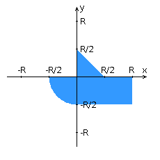

## Задание
##### Вариант 568

На языке Java написать консольную программу, которая определяет, какие точки из множества {{4, -3}, {-2, 1}, {-2, 1}, {-4, -4}, {-5, 4}, {2, 1}, {0, 0}, {5, 4}, {2, -1}} входят в заданную область S.

###### Приложение должно содержать следующие классы:
- Класс Mark, представляющий точку с координатами X и Y типа float.
- Класс Figure, представляющий область с заданным параметром R типа double, в котором должен быть реализован метод, возвращающий для заданной точки значение 1, если точка входит в область, и 0, если не входит. Попадание на границу области cчитается попаданием в область.
- Основной класс Lab3, в котором необходимо реализовать получение значения R в качестве аргумента командной строки. Преобразование из строки в число реализовать c помощью метода Double.parseDouble().