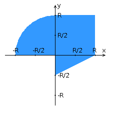

## Задание
##### Вариант 1105

Доработать программу из лабораторной работы №3 следующим образом. Реализовать приложение на базе Swing API, которое отображает на экране заданную область и заданные компоненты пользовательского интерфейса, с помощью которых вводятся данные о координатах точек и параметре R.  
При щелчке мышкой по графику должна отображаться точка, цвет которой зависит от попадания или непопадания в область, при этом компоненты графического интерфейса должны отображать значения координат точки. При задании значений координат точки и R на графике должна также отображаться точка соответствующего цвета.  
Согласно полученному варианту необходимо реализовать анимацию с использованием Java-потоков.

###### Приложение должно использовать следующие элементы:
- Для задания координаты X использовать JList.
- Для задания координаты У - JRadioButton.
- Для задания R - JSpinner.
- Для отображения координат установленной точки - JLabel.
- Элементы необходимо группировать с использованием менеджера компоновки GridLayout.
- В рамках групп необходимо использовать BoxLayout .
- При изменении радиуса должна осуществляется перерисовка точек с пересчетом масштаба.
- При отрисовке области в качестве цвета фона использовать белый цвет.
- Для заливки области использовать черный цвет.  

###### Приложение должно включать анимацию следующего вида: 
После установки размер точки должен циклически изменяться от R/10 до R/20 значения и обратно
Условие запуска анимации: вход в область одной из точек при изменении радиуса.  
Многопоточность должна быть реализована с помощью реализации интерфейса Runnable.