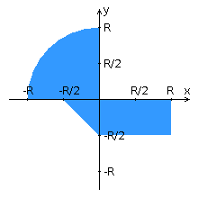

## Задание
##### Вариант 9004

Разделить приложение из лабораторной работы №4 на две составляющие - клиентскую и серверную, обменивающиеся сообщениями по заданному протоколу.  
На стороне клиента осуществляются ввод и передача данных серверу, прием и отображение ответов от сервера и отрисовка области. В сообщении клиента должна содержаться вся необходимая информация для определения факта попадания/непопадания точки в область.  
Сервер должен принимать сообщения клиента, обрабатывать их в соответствии с заданной областью и отправлять клиенту ответное сообщение, содержащее сведения о попадании/непопадании точки в область.

###### Приложение должно удовлетворять следующим требованиям:
- Для передачи сообщений необходимо использовать протокол UDP.
- Для данных в сообщении клиента должен использоваться тип double.
- Для данных в ответном сообщении сервера должен использоваться тип Integer.
- Каждое сообщение на сервере должно обрабатываться в отдельном потоке. Класс потока должен быть унаследован от класса Thread.
- Приложение должно быть локализовано на 2 языка - русский и португальский.
- Строки локализации должны храниться в текстовом файле.
- Приложение должно корректно реагировать на "потерю" и "восстановление" связи между клиентом и сервером; в случае недоступности сервера клиент должен показывать введённые пользователем точки серым цветом.