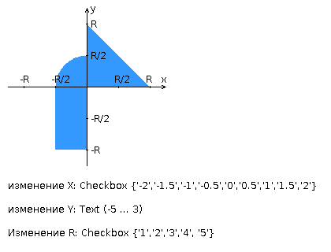

## Задание
##### Вариант 1101

Разработать PHP-скрипт, определяющий попадание точки на координатную плоскость в заданную область и создать HTML-страницу, которая формирует данные для отправки их на обработку этим скриптом.  
Параметр R и координата точки должны передаваться скрипту посредством HTTP-запроса.Скрипт должен выполнять валидацию данных и возвращать HTML-страницу с таблицей, содержащей полученные параметры и результат вычислений - факт попадания или непопадания точки в область.  
Кроме того, ответ должен содержать данные о текущем времени и времени работы скрипта.

###### Разработанная HTML-страница должна удовлетворять следующим требованиям:
- Для расположения текстовых и графических элементов необходимо использовать блочную верстку.
- Данные формы должны передаваться на обработку посредством GET-запроса.
- Таблицы стилей должны располагаться в самом веб-документе.
- При работе с CSS должно быть продемонстрировано использование селекторов псевдоэлементов, селекторов псевдоклассов, селекторов идентификаторов, селекторов элементов а также такие свойства стилей CSS, как наследование и каскадирование.
- HTML-страница должна иметь "шапку", содержащую ФИО студента, номер группы и новер варианта. При оформлении шапки необходимо явным образом задать шрифт (fantasy), его цвет и размер в каскадной таблице стилей.
- Отступы элементов ввода должны задаваться в процентах.